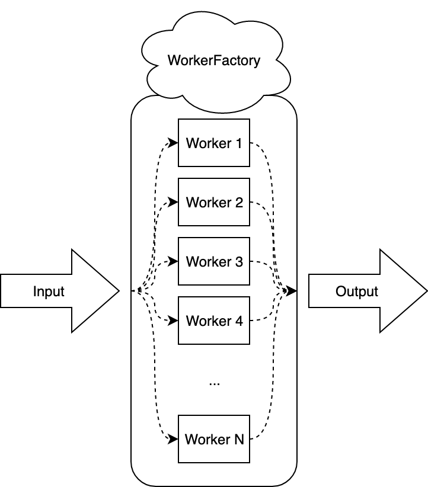
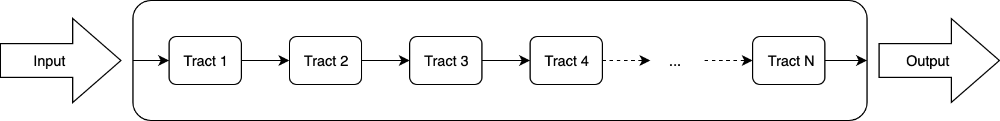
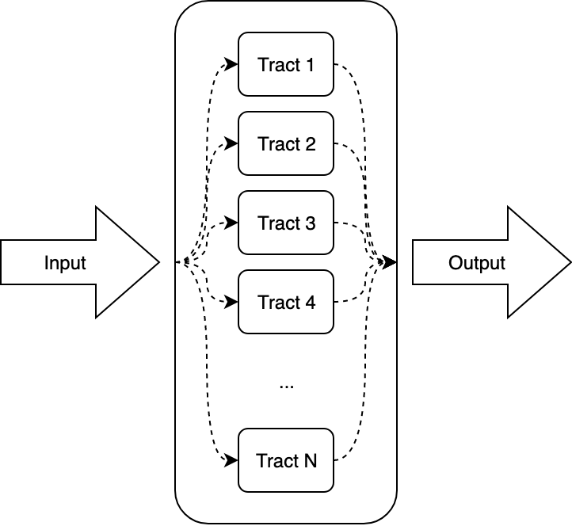
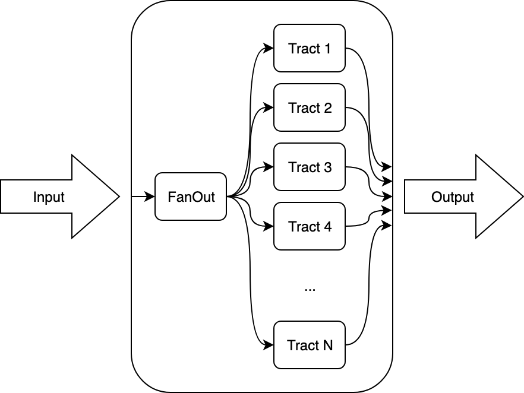

# Tract
Tract is a highly concurrent, scalable design pattern. It has no need for you
to keep track of and maintain wait groups nor channels, so you can just focus on
the business logic.

Tracts automatically initialize and close all their resources when initialized
and closed as a whole: no need keep track of what order to initialize and close
each resource yourself.

Tracts encourage the proper use of and closure of shared and non-shared
resources via Workers and Worker Factories.

Tract support automatic metric gathering, giving you the full picture of any
bottlenecks in the program. Knowing exactly where in your program latency is
being incurred facilitates quick performance debugging.

# Tract Types
There are different types of tracts:
* [Worker Tract](#worker-tract)
* Group Tracts
  - [Serial Tract](#serial-tract)
  - [Paralell Tract](#paralell-tract)
  - [Fan Out Tract](#fan-out-tract)

## Worker Tract

A worker tract has a worker factory that creates N workers when initialized.
When this tract receives a request on its input, one of the workers will pull
that request, process it, then pass it along to the worker tract's output.

## Serial Tract

A serial tract has multiple tracts that are linked together serially when initialized.
When this tract receives a request on its input, it is pulled from the first tract and
passed to each tract in the group sequentially until it reaches the last tract's output
where it is available from the serial tract output.

## Paralell Tract

A paralell tract has multiple independent tracts. When this tract receives a request
on its input, it is pulled by one of the inner tracts, processed by that tract, and
passed along to the paralell tract's output.

## Fan Out Tract

A fanout tract has multiple independent tracts. When this tract receives a request on
its input, it is multiplied and passed to every inner tract. Each of these requests
processes through its tract, and passed along to the fanout tract's output.
